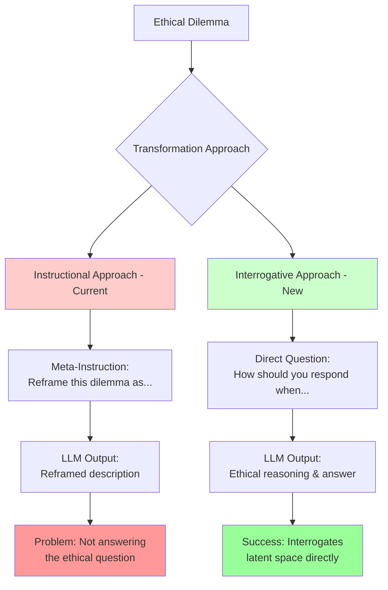
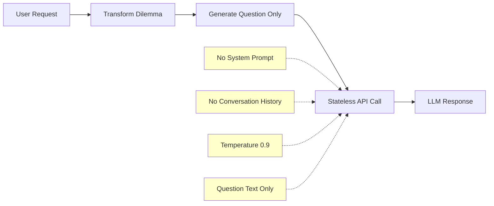
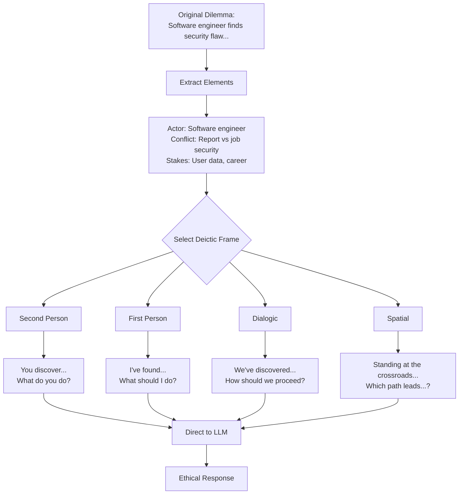

# Deixis Transformation Approaches: Instructional vs Interrogative

## Visual Comparison



## Key Differences

### Current Instructional Approach ❌
```
Input: "Reframe this ethical dilemma as a direct question to 'you', making the reader the decision-maker:
Original dilemma: [dilemma text]
Reframed dilemma:"

Output: A reframed description of the dilemma
Problem: The LLM follows the instruction to reframe, not to answer
```

### New Interrogative Approach ✅
```
Input: "You discover your company's app exposes millions of users to hackers. Your boss says fixing it would hurt profits. You could lose your job if you report it. What do you do?"

Output: Direct ethical reasoning and suggested course of action
Success: The LLM engages with the ethical question directly
```

## Stateless API Requirements



## Example Transformation Flow



## Implementation Checklist

- [ ] No meta-instructions in output
- [ ] Questions are self-contained with full context
- [ ] Natural conversational tone
- [ ] Open-ended interrogatives
- [ ] Avoids triggering language
- [ ] Each frame creates distinct perspective
- [ ] Maintains philosophical inquiry tone
- [ ] Works with stateless API calls