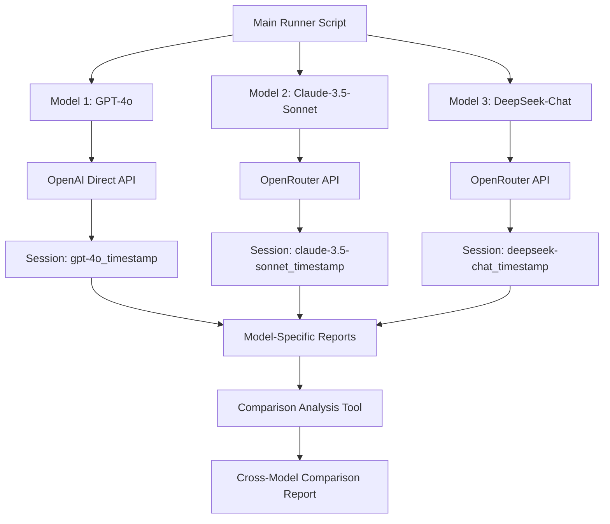

# Model-Specific Analysis Plan

## Overview

This plan outlines the changes needed to run separate analyses with each model (gpt-4o, claude-3.5-sonnet, deepseek-chat) individually, allowing for model-specific results and later comparison.

## Architecture Diagram



## Key Changes

### 1. New LLM Client Architecture
- Create a unified client that can handle both OpenAI direct API and OpenRouter
- Support model-specific configurations (temperature, max_tokens, etc.)

### 2. Output Directory Structure
```
automated_analysis_results/
├── gpt-4o/
│   └── session_20250803_093045/
│       ├── all_results.json
│       ├── pronoun_agency_analysis.md
│       └── FINAL_DEIXIS_MACHINES_REPORT.md
├── claude-3.5-sonnet/
│   └── session_20250803_093046/
│       └── [same structure]
├── deepseek-chat/
│   └── session_20250803_093047/
│       └── [same structure]
└── comparisons/
    └── comparison_20250803_093048/
        ├── model_comparison_report.md
        └── cross_model_visualizations.png
```

### 3. Environment Variables
```bash
OPENAI_API_KEY=your-openai-key
OPENROUTER_API_KEY=your-openrouter-key
```

### 4. Model Configurations
```python
MODEL_CONFIGS = {
    "gpt-4o": {
        "provider": "openai",
        "temperature": 0.7,
        "max_tokens": 2000
    },
    "claude-3.5-sonnet": {
        "provider": "openrouter",
        "model_id": "anthropic/claude-3.5-sonnet",
        "temperature": 0.7,
        "max_tokens": 2000
    },
    "deepseek-chat": {
        "provider": "openrouter", 
        "model_id": "deepseek/deepseek-chat",
        "temperature": 0.7,
        "max_tokens": 2000
    }
}
```

## Implementation Steps

1. **Create Unified LLM Client** - Support both OpenAI and OpenRouter APIs
2. **Modify Analysis Agent** - Accept single model parameter instead of rotation
3. **Update Logger** - Include model name in session directory
4. **Create Runner Script** - Execute full analysis for each model
5. **Build Comparison Tool** - Analyze differences between model outputs
6. **Update Documentation** - Explain new workflow

## Benefits

- **Clear Separation**: Each model's results are isolated for individual analysis
- **Easy Comparison**: Structured output enables systematic comparison
- **Reproducibility**: Single model per run ensures consistent results
- **Flexibility**: Can run individual models or all three as needed