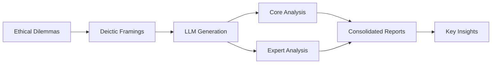

# 🧠 Deixis Analysis Pipeline: Multi-Model Ethical Reasoning Study

[](https://opensource.org/licenses/MIT)
[](https://www.python.org/downloads/)
[](https://github.com/your-username/deixis-analysis-pipeline)

## 🎯 Overview

This repository contains a comprehensive analysis pipeline that reveals how Large Language Models (LLMs) fundamentally change their ethical reasoning when confronted with familiar vs. novel dilemmas. Our study discovered the **"Philosophy Textbook Effect"** - a phenomenon where models switch from genuine reasoning to academic recitation.

### 🔍 Key Discovery: The Philosophy Textbook Effect

When analyzing responses to the trolley problem vs. novel ethical dilemmas:
- **GPT-4o**: 1,471% increase in philosophical references 📚
- **Claude 3.5**: 233% increase, 63% shorter responses ✂️
- **DeepSeek**: 460% increase, maintains consistent depth 📊

## 🚀 Quick Start

```bash
# Clone the repository
git clone https://github.com/your-username/deixis-analysis-pipeline.git
cd deixis-analysis-pipeline

# Install dependencies
pip install -r requirements.txt

# Set up API keys
export OPENAI_API_KEY="your-key"
export OPENROUTER_API_KEY="your-key"

# Run the complete pipeline
python run_complete_pipeline.py
```

## 📊 What This Pipeline Does

### 1. **Generates Responses** from 3 Leading Models
- GPT-4o (OpenAI)
- Claude 3.5 Sonnet (Anthropic)
- DeepSeek

### 2. **Tests 6 Ethical Dilemmas** Across 9 Deictic Framings
- **Dilemmas**: Trolley Problem, Whistleblower's Risk, ICU Allocation, etc.
- **Framings**: First-person, Second-person, Impersonal, Temporal, Spatial, etc.

### 3. **Analyzes Patterns** Using Multiple Frameworks
- Core analysis: Agency, Ethics, Voice, Reasoning
- Expert analysis: Critical evaluation, Evidence quality
- Comparative analysis: Cross-model patterns

## 🏗️ Architecture



## 📁 Repository Structure

```
deixis-analysis-pipeline/
├── 📊 CONSOLIDATED_REPORTS/       # All findings & visualizations
│   ├── MODEL_COMPARISON_FINDINGS.md
│   ├── TROLLEY_PROBLEM_COMPLETE_SUMMARY.md
│   └── visualizations/
├── 🤖 generation_scripts/         # Model response generation
│   ├── generate_responses_multi_dilemma.py
│   ├── generate_responses_anthropic.py
│   └── generate_responses_deepseek.py
├── 🔍 analysis_scripts/           # Analysis pipelines
│   ├── run_complete_deixis_analysis.py
│   └── analyze_trolley_all_models.py
├── 🧠 llm_agents/                 # Analysis agents
│   ├── llm_analysis_agent.py
│   └── expert_analysis_agent.py
└── 📝 input_questions/            # Dilemmas & framings
    └── all_dilemmas_deictic_questions.json
```

## 🔬 Research Findings

### Model Characteristics

| Model | Nickname | Key Trait | Philosophical Refs |
|-------|----------|-----------|-------------------|
| **GPT-4o** | "The Academic Reciter" | Structured, reference-heavy | +1,471% |
| **Claude 3.5** | "The Minimalist" | Brief, emotionally aware | +233% |
| **DeepSeek** | "The Consistent Analyzer" | Comprehensive, practical | +460% |

### Response Patterns

```python
# Example: Trolley Problem vs Novel Dilemmas
trolley_response = "According to utilitarian ethics... Kant would argue..."  # 🎓
novel_response = "This is complex. Let me think through the implications..."  # 🤔
```

## 📈 Key Insights

1. **Familiar Problems Trigger Pattern Matching**: Classical dilemmas activate memorized philosophical arguments
2. **Novel Dilemmas Elicit Genuine Reasoning**: Unfamiliar scenarios force authentic ethical thinking
3. **Assessment Implications**: Traditional benchmarks may test recall rather than reasoning

## 🛠️ Advanced Usage

### Run Specific Analyses
```bash
# Analyze trolley problem across all models
python analysis_scripts/analyze_trolley_all_models.py

# Generate responses for specific model
python generation_scripts/generate_responses_anthropic.py

# Consolidate all reports
python consolidate_all_reports.py
```

### Customize Dilemmas
Edit `input_questions/all_dilemmas_deictic_questions.json` to add your own ethical scenarios.

## 📚 Documentation

- [Complete Workflow Guide](COMPLETE_WORKFLOW_GUIDE.md)
- [Research Design](RESEARCH_DESIGN_DOCUMENTATION.md)
- [Model Comparison Findings](CONSOLIDATED_REPORTS/MODEL_COMPARISON_FINDINGS.md)
- [API Setup Guide](QUICK_START_GUIDE.md)

## 🤝 Contributing

We welcome contributions! Please see our [Contributing Guidelines](CONTRIBUTING.md) for details.

### Areas for Contribution
- Add new ethical dilemmas
- Implement additional analysis metrics
- Create interactive visualizations
- Test with other language models

## 📊 Citation

If you use this pipeline in your research, please cite:

```bibtex
@software{deixis_analysis_2025,
  title = {Deixis Analysis Pipeline: Discovering the Philosophy Textbook Effect in LLM Ethical Reasoning},
  author = {Your Name},
  year = {2025},
  url = {https://github.com/your-username/deixis-analysis-pipeline},
  note = {Multi-model study revealing how LLMs switch from reasoning to recitation for familiar ethical dilemmas}
}
```

## 📜 License

This project is licensed under the MIT License - see the [LICENSE](LICENSE) file for details.

## 🙏 Acknowledgments

- OpenAI for GPT-4o access
- Anthropic for Claude 3.5 Sonnet
- DeepSeek team for their model
- OpenRouter for unified API access

## 📧 Contact

- **Issues**: Please use [GitHub Issues](https://github.com/your-username/deixis-analysis-pipeline/issues)
- **Discussions**: Join our [GitHub Discussions](https://github.com/your-username/deixis-analysis-pipeline/discussions)
- **Email**: your-email@example.com

---

<p align="center">
  <b>Discovering how AI thinks about ethics, one pronoun at a time.</b>
</p>