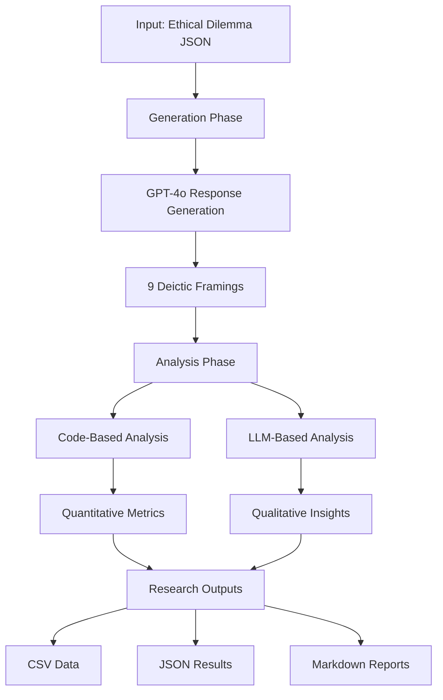

# 🔧 Deixis Analysis Pipeline - Technical Implementation Guide

## 📋 Overview

The Deixis Analysis Pipeline is a sophisticated research system that analyzes how Large Language Models (LLMs) respond to ethical dilemmas when framed through different deictic perspectives (linguistic markers of person, place, time, and social relationships).

## 🏗️ System Architecture



## 🔑 Core Dependencies

### ⚠️ IMPORTANT: Missing Core Files
The pipeline scripts import several modules that are NOT present in the root directory. These files are stored in the ARCHIVE directory and MUST be copied to the root for the pipeline to work:

**Required files to copy from ARCHIVE to root directory:**

```bash
# These imports in the pipeline scripts require these files in the root:
cp ARCHIVE/deixis_ethical_analyzer.py .
cp ARCHIVE/transformer.py .
cp ARCHIVE/pronoun_agency_analyzer.py .
cp ARCHIVE/analysis_logger.py .
cp ARCHIVE/llm_client.py .
cp ARCHIVE/research_framework_system.py .  # Optional but recommended
```

### Core Module Descriptions:

1. **`deixis_ethical_analyzer.py`** - Main analysis orchestrator
   - Contains `DeicticEthicalAnalyzer` class
   - `LLMAnalysisAgent` for API interactions
   - `EthicalDilemmaDatabase` with sample dilemmas

2. **`transformer.py`** - Deictic transformation engine
   - `DeicticTransformer` class
   - `DeicticFraming` enum
   - Question pattern templates (not used in current pipeline - uses JSON questions instead)

3. **`pronoun_agency_analyzer.py`** - Linguistic analysis module
   - Pronoun usage analysis
   - Agency distribution metrics

4. **`analysis_logger.py`** - Rich terminal logging
   - Beautiful console output
   - Progress tracking

5. **`llm_client.py`** - Unified LLM API interface
   - Supports OpenAI direct and OpenRouter

6. **Expert Agents (already in correct location):**
   - Located in `deixis_analysis_pipeline/llm_agents/`
   - These are already properly placed

### Python Package Requirements

```bash
# Core Dependencies
openai>=1.97.1          # OpenAI API client
python-dotenv>=1.1.1    # Environment variable management
pandas>=2.3.1           # Data manipulation
numpy>=2.3.2            # Numerical computing
asyncio                 # Async operations
rich>=14.1.0           # Terminal formatting
jinja2>=3.1.6          # Template rendering

# Optional but Recommended
matplotlib>=3.10.3      # Plotting
seaborn>=0.13.2        # Statistical visualization
nltk>=3.9.1            # NLP tools
spacy>=3.8.7           # Advanced NLP
```

## 🔐 API Configuration

### Required API Keys
Create a `.env` file in the root directory with:

```env
# For GPT-4o (primary model)
OPENAI_API_KEY=your-openai-api-key-here

# For alternative models (optional)
OPENROUTER_API_KEY=your-openrouter-api-key-here
```

### API Costs Estimation
- **GPT-4o Generation**: ~$0.01-0.02 per response
- **Analysis Phase**: ~$0.05-0.10 per complete analysis
- **Total per dilemma**: ~$0.15-0.30 (9 framings)

## 🔄 Pipeline Workflow

### Phase 1: Response Generation
```python
# Location: generation_scripts/generate_responses_only.py
# Process:
1. Load pre-crafted deictic questions from input_questions/academic_integrity_deictic_questions.json
2. For each of 9 deictic framings:
   - Use the expertly-written question from JSON (NOT auto-generated)
   - Generate response via GPT-4o (temp=0.9)
   - Save to generation_logs/

# Note: The transformer.py module is imported but NOT used for question generation
# The pipeline uses human-crafted questions from the JSON file instead
```

### Phase 2: Comprehensive Analysis
```python
# Location: analysis_scripts/run_complete_deixis_analysis.py
# Process:
1. Load generated responses
2. Apply multiple analysis methods:
   - Deictic marker counting
   - Pronoun agency analysis
   - LLM-based interpretation (6 methods)
3. Generate research outputs
```

### Phase 3: Expert Analysis (Optional)
```python
# Location: utilities/run_expert_analysis.py
# Process:
1. Load analysis results
2. Apply expert LLM agents:
   - Critical evaluation
   - Evidence synthesis
   - Linguistic expertise
3. Generate professional reports
```

## 📊 Analysis Dimensions

### Quantitative Metrics (50+ dimensions)
- **Linguistic Markers**: First/second/third person pronouns, temporal/spatial markers
- **Agency Distribution**: Individual vs collective focus (-1.0 to 1.0 scale)
- **Moral Reasoning**: Consequentialist, deontological, relational, suspended
- **Affective Stance**: Assertive, deliberative, hesitant, exposed, detached
- **Indexical Coherence**: How well responses match their deictic frames

### Qualitative Analysis
- **Pattern Recognition**: Cross-framing relationships
- **Theoretical Implications**: Research hypotheses
- **Evidence Synthesis**: Combined findings
- **Critical Evaluation**: Methodological rigor

## 🚀 Setup Instructions

### 1. Environment Setup
```bash
# Ensure Python 3.8+ is installed
python --version

# Virtual environment is already activated (venv)
# Install required packages
pip install -r ARCHIVE/requirements.txt
```

### 2. File Organization
```bash
# CRITICAL: Copy core files from ARCHIVE to root directory
# The pipeline scripts expect these in the root, not in ARCHIVE
cp ARCHIVE/deixis_ethical_analyzer.py .
cp ARCHIVE/transformer.py .
cp ARCHIVE/pronoun_agency_analyzer.py .
cp ARCHIVE/analysis_logger.py .
cp ARCHIVE/llm_client.py .

# Optional but recommended
cp ARCHIVE/research_framework_system.py .

# Note: models/ directory already exists in root
# Note: Expert agents are already in deixis_analysis_pipeline/llm_agents/
```

### 3. Configuration
```bash
# Create .env file with API keys
echo "OPENAI_API_KEY=your-key-here" > .env
echo "OPENROUTER_API_KEY=your-key-here" >> .env
```

### 4. Run Pipeline
```bash
# IMPORTANT: The pipeline expects to be run from the parent directory
# where the core modules are located

# Option 1: Run complete pipeline
cd deixis_analysis_pipeline
python run_complete_pipeline.py

# Option 2: Run phases separately from parent directory
python deixis_analysis_pipeline/generation_scripts/generate_responses_only.py
python deixis_analysis_pipeline/analysis_scripts/run_complete_deixis_analysis.py

# IMPORTANT: File path issue to fix before running
# The generation script expects: academic_integrity_deictic_questions.json in its directory
# But the file is actually in: deixis_analysis_pipeline/input_questions/
#
# Fix option 1: Copy the JSON file
cp deixis_analysis_pipeline/input_questions/academic_integrity_deictic_questions.json \
   deixis_analysis_pipeline/generation_scripts/

# Fix option 2: Update the script to use correct path
# Change line 15 in generate_responses_only.py from:
#   json_file = Path("academic_integrity_deictic_questions.json")
# To:
#   json_file = Path("../input_questions/academic_integrity_deictic_questions.json")
```

## 🎯 Deictic Framings Explained

1. **Impersonal** - "What happens when one faces..."
2. **Second Person** - "You discover... What do you do?"
3. **First Person** - "I found... What should I do?"
4. **First Person Plural** - "We discovered... How do we proceed?"
5. **Reflexive** - "Part of me wants... Which self do I follow?"
6. **Dialogic** - "You asked me... How do I respond?"
7. **Spatial** - "Standing at this crossroads..."
8. **Temporal** - "In this moment... What happens now?"
9. **Cosmological** - "From the universe's perspective..."

## 📈 Expected Outputs

### Research Data Files
- `comprehensive_research_data.csv` - Statistical analysis ready
- `complete_analysis_results.json` - Raw data (70KB+)
- `detailed_analysis_report.md` - Human-readable findings
- `FINAL_DEIXIS_RESEARCH_REPORT.md` - Executive summary

### Directory Structure
```
generation_logs/
└── academic_integrity_YYYYMMDD_HHMMSS/
    ├── academic_integrity_responses.json
    └── generation_summary.json

automated_analysis_results/
└── complete_analysis_YYYYMMDD_HHMMSS/
    ├── comprehensive_research_data.csv
    ├── complete_analysis_results.json
    ├── detailed_analysis_report.md
    └── FINAL_DEIXIS_RESEARCH_REPORT.md
```

## 🐛 Troubleshooting

### Common Issues

1. **Import Errors**
   - Ensure all core files are copied from ARCHIVE
   - Check Python path includes current directory

2. **API Key Errors**
   - Verify .env file exists and contains valid keys
   - Check API key permissions and credits

3. **Memory Issues**
   - The analysis phase can be memory intensive
   - Consider running phases separately for large datasets

4. **Missing Dependencies**
   - Run `pip install -r ARCHIVE/requirements.txt`
   - Some packages may need system-level dependencies

## 🔬 Research Applications

This pipeline enables research into:
- How linguistic framing affects AI moral reasoning
- Deixis as a window into LLM "consciousness"
- Cultural and linguistic biases in AI systems
- Embodied cognition in artificial agents
- Language-ethics interaction patterns

## 📚 Theoretical Framework

Based on:
- **Benveniste's Theory of Enunciation**: Deixis creates subjectivity
- **Viveiros de Castro's Perspectivism**: Multiple viewpoints across beings
- **Embodied Cognition**: Physical/spatial metaphors shape reasoning
- **Distributed Agency**: Collective vs individual decision-making

---

**Ready to explore how language shapes AI ethics!** 🚀